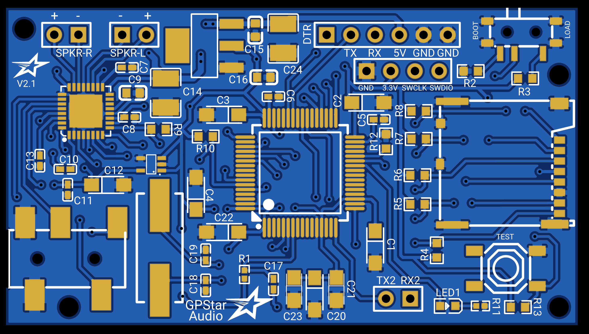
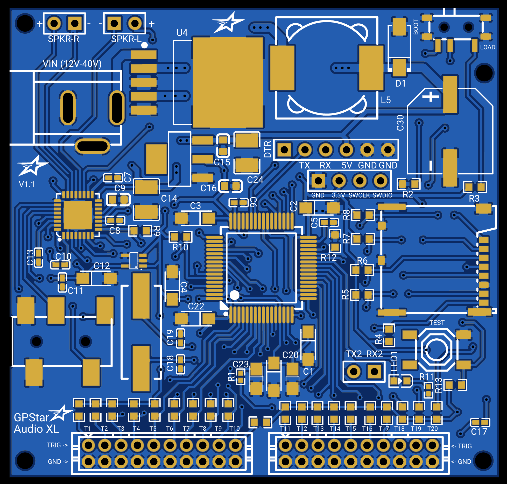
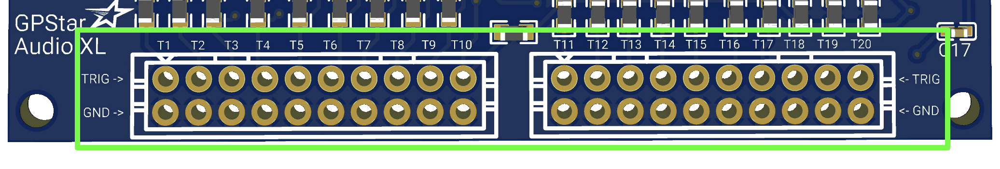

##  GPStar Audio - Serial Library

This repository contains the serial communication control library for the [GPStar Audio](https://gpstartechnologies.com/products/gpstar-audio) and [GPStar Audio XL](https://gpstartechnologies.com/products/gpstar-audio-xl) series of audio boards from GPStar Technologies. They are compatible with Arduino and other microcontrollers and in the case of the XL version, sounds can be triggered from the bank of 20 available trigger pins.

GPStar Audio and GPStar Audio XL are polyphonic audio players capable of playing up to 14 stereo WAV files at the same time, layering them, mixing and crossfading with independent track control of volume, pause, resume.

It has a 3.5mm stereo auxilliary jack, and its onboard stereo amplifier is capable of driving 2 speakers (2.5W @ 4Ω or 1.25W @ 8Ω per channel) from the onboard amplifier. Powered with 5V to the 5V and GND pins it can be controlled over a serial interface with an Arduino or any other microcontroller. It can be used for a variety of projects such as toys, musical instruments, props or any other embedded projects.

Example code to demonstrate some of the GPStar Audio's features can be found in the examples folder.

## Serial commands ##

**GPStarAudio.start(SerialObject)** - This must be called first to setup the serial communications. You must initalise the serial object and pass it to the function. Example: `Serial.begin(57600);` `GPStarAudio.start(Serial);`

**GPStarAudio.flush()** - Flushes all data from the GPStarAudio instance. Note this is called automatically in `start()` and so should not be necessary after initialisation.

**GPStarAudio.serialFlush()** - Flushes the serial buffer of whichever serial UART is associated with this GPStarAudio instance.

**GPStarAudio.hello()** - Call this to have the GPStar Audio respond with a hello request. Various information is returned such as the number of tracks and version number. See next methods to check for the return values.

**GPStarAudio.gpstarAudioHello()** - Returns a `bool` for whether the `hello()` command was accepted by the GPStar Audio and if `true` populates the variable for the total number of tracks on the micro SD card (see `GPStarAudio.getNumTracks()` below).

**GPStarAudio.getVersionNumber()** - Returns a `uint16_t` with the current firmware version of GPStar Audio. Available on firmware version 1.04 and up and returns `0` if not supported.

**GPStarAudio.requestSystemInfo()** - Call this to have the GPStar Audio respond with an `RSP_SYSTEM_INFO` packet. This function is provided for backwards compatibility with other polyphonic audio boards.

**GPStarAudio.wasSysInfoRcvd()** - Returns a `bool` for whether the `requestSystemInfo()` command was accepted by the GPStar Audio and if `true` populates the variable for the total number of tracks on the micro SD card (see `GPStarAudio.getNumTracks()` below). This function is provided for backwards compatibility with other polyphonic audio boards.

**GPStarAudio.requestVersionString()** - This function is provided for backwards compatibility with other polyphonic audio boards and has no effect on a GPStar Audio board.

**GPStarAudio.getVersion(char\* version)** - Returns `false` for whether the `RSP_VERSION_STRING` packet was received. This function is provided for backwards compatibility with other polyphonic audio boards.

**GPStarAudio.update()** - Calling this will process any incoming serial data from GPStar Audio. If you are using `currentTrackStatus()` calls, then you will want to call this often.

**GPStarAudio.getNumTracks()** - This returns a `uint16_t` of the number of tracks on the micro SD card. Note that you must have called `hello()` followed by `gpstarAudioHello()` first for this to return a valid value.

**GPStarAudio.masterGain(int16_t gain)** - This sets the master gain (in dB) of the audio output amplifier. The range is `-59` (quietest) to `24` (loudest). Note that `24` is only achievable using the speaker amplifier. If using the headphone jack, the output amplifier gain has a maximum of `18`.

**GPStarAudio.trackPlaySingle(uint16_t trk)** - This will stop any tracks that are currently playing and play the selected track number provided.

**GPStarAudio.trackPlaySingle(uint16_t trk, bool lock)** - This will stop any tracks that are currently playing and play the selected track number provided. If `lock` is set to `true`, the track will not not ever be unloaded or stopped from the channel it has acquired if the maximum number of channels are in use unless you manually tell the track to stop.

**GPStarAudio.trackPlayPoly(uint16_t trk)** - This will play the provided track number, mixing and overlaying it with any other tracks that are currently playing.

**GPStarAudio.trackPlayPoly(uint16_t trk, bool lock)** - This will play the provided track number, mixing and overlaying it with any other tracks that are currently playing. If `lock` is set to `true`, the track will not not ever be unloaded or stopped from the channel it has acquired if the maximum number of channels are in use unless you manually tell the track to stop.

**GPStarAudio.trackPlayPoly(uint16_t trk, bool lock, uint16_t trk_2, bool loop_trk2, uint16_t trk2_start_time)** - This will play the provided track number (trk), mixing and overlaying it with any other tracks that are currently playing. If `lock` is set to `true`, the track will not be unloaded or stopped from the channel it has acquired if the maximum number of channels are in use unless you manually tell the track to stop. trk_2 will be put into a queue. trk2_start_time is the time in milliseconds remaining when trk reaches during it's playback, which will then trigger trk2 to start playing. Set loop_trk2 to true to have the queued track to loop, false for it to play only one time. The queued track will share the same track lock value as the first track. trk can only trigger the queue to play one time until it is reset again.

**GPStarAudio.trackQueueClear()** - This will clear out the track queue if you set another track to play immediately with the trackPlayPoly command.

**GPStarAudio.trackStop(uint16_t trk)** - This stops the provided track number if it is currently playing and frees the channel it was using.

**GPStarAudio.trackPause(uint16_t trk)** - This will pause the provided track number if it is currently playing. The track will still stay loaded and hold the current channel it is allocated.

**GPStarAudio.trackResume(uint16_t trk)** - This will resume the provided track if it is currently paused.

**GPStarAudio.trackLoop(uint16_t trk, bool enable)** - This will set a track to loop or not loop. When set to loop, the track will automatically replay itself until you call `GPStarAudio.trackStop(int t)` or set the the track looping off. Set to true to enable looping or false to disable looping.

**GPStarAudio.trackGain(uint16_t trk, int16_t gain)** - This will set the volume of the provided track number. The volume range is `-59` (quietest) to `0` (loudest). This only affects the volume of this track within the mix, not the gain of the output amplifier.

**GPStarAudio.trackFade(uint16_t trk, int16_t gain, uint16_t time, bool stopFlag)** - This will fade the currently playing provided track number. The track volume will logarithmically fade to the target gain you provide from whatever volume the track is already playing at. The `stopFlag` by default is `false` which will keep the track playing after the fade. Setting the `stopFlag` to `true` will make the track stop playing and free its channel after the fade has finished.

**GPStarAudio.trackLoad(uint16_t trk)** - This will assign the provided track number to a channel paused. This can be useful when combined with the `resumeAllInSync()` method listed below.

**GPStarAudio.trackLoad(uint16_t trk, bool lock)** - This will assign the provided track number to a channel paused. If `lock` is set to `true`, the track will not not ever be unloaded from the channel it has acquired if the maximum number of channels are in use unless you manually tell the track to stop. This can be useful when combined with the `resumeAllInSync()` method listed below.

**GPStarAudio.stopAllTracks()** - This will stop all tracks that are currently playing and free all channels.

**GPStarAudio.resumeAllInSync()** - This will resume all tracks which are currently paused at the exact same time.

**GPStarAudio.samplerateOffset(int16_t offset)** - This sets the sample-rate offset of the main output mix. The range for the offset is `-32767` to `32676`, giving a speed range of 1/2x to 2x or a pitch range of down one octave to up one octave. If audio is playing you will hear the result immediately. If audio is not playing, the new sample-rate offset will be used the next time a track is started.

**GPStarAudio.setLED(bool status)** - You can turn off the LED status indicator by setting `status` to `false`. Passing `true` enables the LED again. By default the LED on GPStar Audio flashes and blinks to provide various status updates.

**GPStarAudio.gpstarShortTrackOverload(bool status)** - Enabled by default. GPStar Audio will detect mulitple versions of the same sound playing in succession and prevent it from overloading and taking too many audio channels, instead replaying the file to save system resources.

**GPStarAudio.gpstarTrackForce(bool status)** - Disabled by default. When enabled, GPStar Audio will forcibly take a audio channel when requested to play a new track even if all channels in use and locked.

**GPStarAudio.trackPlayingStatus(uint16_t trk)** - This will ask GPStar Audio if the provided track number is playing. After calling this method, call the `GPStarAudio.currentTrackStatus(uint16_t trk)` method to find out if the track is playing or not. If the provided track number is not currently playing, this function will also set the internal track counter flag to `false` (see `isTrackCounterReset()`).

**GPStarAudio.currentTrackStatus(uint16_t trk)** - This will retrieve the status of a the provided track number if it is playing. You will want to use the `GPStarAudio.trackPlayingStatus(uint16_t trk)` method first to ask if the provided track is playing, then call this method soon after to retrieve the response.

**GPStarAudio.resetTrackCounter()** - Call this function to reset the state of the internal track counter flag. This is useful, for example, when you want to identify when a specific track has finished playing (such as for music playback). It is recommended to call this right before you start playing the track you intend to have the GPStar Audio follow the status of.

**GPStarAudio.isTrackCounterReset()** - Call this function to see if the internal track counter flag has been reset. This will return `true` if the internal track counter flag has been reset by `resetTrackCounter()`. It will return `false` if `resetTrackCounter()` has never been called or if `trackPlayingStatus(trk)` was called on a track that is not currently playing.

**GPStarAudio.setReporting(bool enable)** - Provided for backwards compatibility with existing polyphonic audio boards, but has no effect on GPStar Audio (which always has track reporting enabled).

**GPStarAudio.setAmpPwr(bool enable)** - Provided for backwards compatibility with existing polyphonic audio boards, but has no effect on GPStar Audio (which uses a headphone sense circuit to dynamically switch between the headphone and speaker amplifiers).

**GPStarAudio.setTriggerBank(uint8_t bank)** - Provided for backwards compatibility with existing polyphonic audio boards, but has no effect on GPStar Audio (which does not support creation of audio banks).

## GPStar Audio - Connection Details

### Standard Connection UART

| Pins | Notes |
|------|-------|
| DTR/TX/RX/5V/GND/GND | This connection serves as the main power source and communication but it also serves as a UART programming header for software updates. Firmware can be flashed here with a standard 5V FTDI Basic. Connect a regulated 5V power source to the 5V and either GND pin to provide power to the device. |

---

### Special Connectors & Switches

| Label | Notes |
|-------|-------|
| BOOT/LOAD | A slide switch button. When set to BOOT the system will operate normally. When set to LOAD the system enters programming mode and allows you to flash updated firmware over the UART connection. Make sure it is set to BOOT afterwards for it to operate. |
| SPKR-R | Right Speaker output from the onboard stereo amplifier. Capable of powering either a 4Ω 2.5W or 8Ω 1.25W speaker at 5V. |
| SPKR-L | Left Speaker output from the onboard stereo amplifier. Capable of powering either a 4Ω 2.5W or 8Ω 1.25W speaker at 5V. |
| AUX | ****Not labelled**** The onboard stereo auxiliary headphone jack outputs stereo sound and can be fed to any type of amplifier or audio device with a 3.5mm auxiliary input jack. When a cable is inserted the system will turn off the onboard stereo amplifier and output sound from this port instead.

#### If you are using the onboard stereo amplifier with only one speaker for a mono output setup, connect the single speaker to either SPKR-R or to SPKR-L only.

#### The onboard stereo amplifier is capable of powering either a 4Ω 2.5W or 8Ω 1.25W speaker at 5V from each channel.

---

### Optional Connectors

| Label | Pins | Notes |
|-------|------|-------|
| ST-LINK | GND/3.3V/SWCLK/SWDIO | ****Not Labelled**** These 4 pins grouped together can be connected to a ST-LINK for debugging or as a alternative way to flash updated firmware. |
| TX2/RX2 | TX2/RX2 | Alternative serial communication port used for debugging. |
| TEST |  | A button located on the lower right corner of the board. Pressing this button will play the first track on the micro SD card. |

## GPStar Audio XL - Connection Details

### Standard Connection UART

| Pins | Notes |
|------|-------|
| DTR/TX/RX/5V/GND/GND | This connection serves as the main 5V power source and communication but it also serves as a UART programming header for software updates. Firmware can be flashed here with a standard 5V FTDI Basic. Connect a regulated 5V power source to the 5V and either GND pin to provide power to the device. |

---

### Special Connectors & Switches

| Label | Notes |
|-------|-------|
| VIN (12V-40V) | You can power the device through the DC barrel jack. It can accept voltage ranges from 12V up to 40V. You can also power the device via the UART connection mentioned above. |
| BOOT/LOAD | A slide switch button. When set to BOOT the system will operate normally. When set to LOAD the system enters programming mode and allows you to flash updated firmware over the UART connection. Make sure it is set to BOOT afterwards for it to operate. |
| SPKR-R | Right Speaker output from the onboard stereo amplifier. Capable of powering either a 4Ω 2.5W or 8Ω 1.25W speaker at 5V. |
| SPKR-L | Left Speaker output from the onboard stereo amplifier. Capable of powering either a 4Ω 2.5W or 8Ω 1.25W speaker at 5V. |
| AUX | ****Not labelled**** The onboard stereo auxiliary headphone jack outputs stereo sound and can be fed to any type of amplifier or audio device with a 3.5mm auxiliary input jack. When a cable is inserted the system will turn off the onboard stereo amplifier and output sound from this port instead.

#### If you are using the onboard stereo amplifier with only one speaker for a mono output setup, connect the single speaker to either SPKR-R or to SPKR-L only.

#### The on-board stereo amplifier is capable of powering either a 4Ω 2.5W or 8Ω 1.25W speaker at 5V from each channel.

---
### Triggering Pins

Up to 20 triggering pins are availble on the GPStar Audio XL. They have JST-PH 2.0mm spacing between each bank of 10 pins.

| Label | Notes |
|-------|-------|
| T1 - T20 | You can manually trigger sounds assigned to these pins by connecting them to the below ground pin. You can do this easily with standard push buttons or switches. These pins can be configured in the configuration file that is placed on the micro SD card (see below) to play different sounds, and/or set the playback parameters of the assigned file such as looping. By default they will play sound 1 through 20.

### Optional Connectors

| Label | Pins | Notes |
|-------|------|-------|
| ST-LINK | GND/3.3V/SWCLK/SWDIO | ****Not Labelled**** These 4 pins grouped together can be connected to a ST-LINK for debugging or as a alternative way to flash updated firmware. |
| TX2/RX2 | TX2/RX2 | Alternative serial communication port used for debugging. |
| TEST |  | A button located on the lower right corner of the board. Pressing this button will play the first track on the micro SD card. |

## Configuration file
A configuration file is not required. However you can configure some settings by placing a `GPStarAudio.ini` configuration file into the root of the micro SD card. An example file can be found in this repository. If a configuration file is not found on the micro SD card the default settings are used.

Many options can be set, such as the default output amplifier gain, serial communication baud rate, LED settings and to how the trigger pins handle playback.

The syntax of the file is very simple, using enclosed square brackets to setup configuration areas.

**[gpstarconfig]:** This area can set the general settings of the board. If none of these settings exist in the ini file, then the system will default to the default settings for each option.

**volume&#95;amplifier:** This sets the master gain (in dB) of the stereo speaker amplifier. The range is `-53` (quietest) to `24` (loudest). The default is `0`.

**volume&#95;aux:** This sets the master gain (in dB) of the stereo headphone amplifier. The range is `-59` (quietest) to `18` (loudest).  The default is `0`.

**serial&#95;baud&#95;rate:** You can configure the speed of the serial communication used for controlling the GPStar Audio. The default is `57600`.

**led&#95;off:** Control whether the onboard status LED flashes or not during playback or non playback. Valid values are 0 for allowing the LED to function or `1` for disabling the LED. The default is `0`.

## Trigger configuration
Unique to GPStar Audio XL are the trigger pins. These can be setup so you can play sounds without any coding. You can also conigure the behaviour of these pins by setting them up into the GPStarAudio.ini configuration file. Please refer to the example configuration file located in this repository for usage.

Note that these do not need to be configured for the trigger pins to operate and if `GPStarAudio.ini` is not on the micro SD card the default settings are loaded for the trigger pins.

**[gpstartracks]:** This area contains playback setup and configuration of the 20 trigger pins. The pins are identified by gp1_ prefix in the ini file. The range is from `gp1_` up to `gp20_`.

**gp#&#95;playback:** Control how the playback is assigned to this trigger. Valid settings are `normal` or `loop`. `normal` will play the file until completion then it stops. `loop` will continuously loop the the audio until the pin is triggered again. Default is `normal`.

**gp#&#95;trigger:** Set how the audio is triggered. Valid settings are `press` or `hold`. With `press`, when you make contact between the trigger pin and the ground pin below it the audio file will play and will contiinue to play even when you release the contact between the trigger pin and ground pin. With `hold`, you need to make continuous contact between the trigger pin and ground pin for the audio to play, as releasing the contact will cause it to stop. Default is `press`.

**gp#&#95;file_number:** The track number on the microSD card. The default is the pin number of this trigger. For example, set this to `100` to play the wav file with the `100_` prefix.

**gp#&#95;volume:** The default volume for the track. Valid ranges are `0` to `-59`, with `0` being the loudest and `-59` being the most quiet. The default is `0`.

## Links

* [GPStar Audio product page](https://gpstartechnologies.com/products/gpstar-audio)
* [GPStar Audio XL product page](https://gpstartechnologies.com/products/gpstar-audio-xl)
* [GPStar Audio firmware downloads](https://gpstartechnologies.com/pages/support-downloads)

## License

Released under the GNU GPLv3 license.

Copyright (c) 2024 GPStar Technologies.
