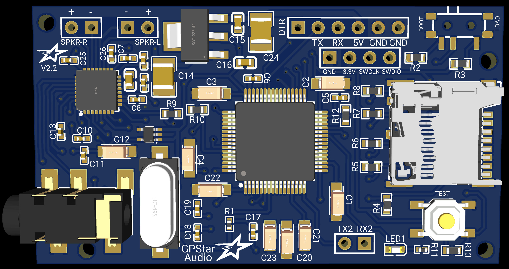
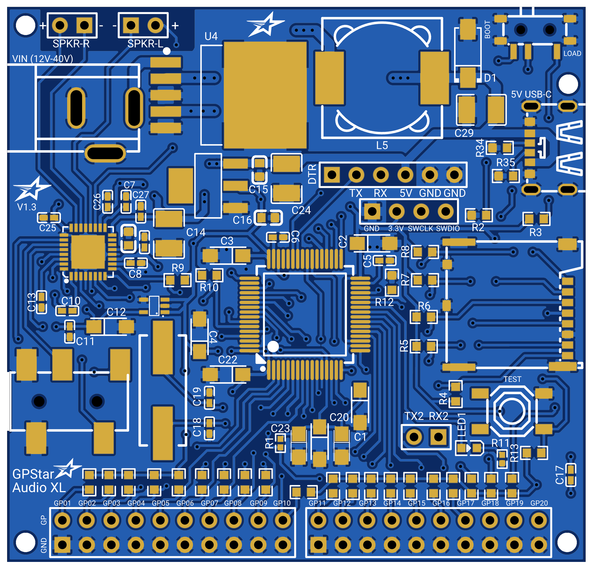

##  GPStar Audio - Serial Library

This repository contains the serial communication control library for the [GPStar Audio](https://gpstartechnologies.com/products/gpstar-audio) and [GPStar Audio XL](https://gpstartechnologies.com/products/gpstar-audio-xl) series of audio boards from GPStar Technologies. They are compatible with Arduino and other microcontrollers and in the case of the XL version, sounds can be triggered from the bank of 20 available trigger pins.

[](https://gpstartechnologies.com/products/gpstar-audio)

GPStar Audio and GPStar Audio XL are polyphonic audio players capable of playing up to 14 stereo wav files at the same time, layering them, mixing, cross fading, with independent track control of volume, pause, resume.

It's onboard stereo amplifier is capable of driving 2 speakers (2.5W @ 4Ω or 1.25W @ 8Ω per channel) from the onboard amplifier and also has a stereo out auxiliary jack. Powered with 5V to the 5V and GND pins, it can be controlled over a serial interface with a Arduino or any other microcontroller. It can be used for a variety of projects such as toys, musical instruments, props or any other embedded projects.

```
#include <AltSoftSerial.h>
#include <GPStarAudio.h>
```

By default, GPStar Audio and GPStar Audio XL are configured to use AltSoftSerial for communication. However if you want to use a hardware serial port on your microcontroller that you are using, then make the following changes in the `GPStarAuduio.h file`.

```
// ------------------------------------------------
// Uncomment only the serial class you wish to use.
#define __GPSTAR_AUDIO_USE_ALTSOFTSERIAL__
//#define __GPSTAR_AUDIO_USE_SERIAL1__
//#define __GPSTAR_AUDIO_USE_SERIAL2__
//#define __GPSTAR_AUDIO_USE_SERIAL3__
// ------------------------------------------------
```

Uncomment out the line with the serial port you wish to use and comment out the ones that are not used.

Example code can be found in the example folder in how to use this library.

## Serial commands ##

**GPStarAudio.start()** - This must be called first, to setup the serial communications.

**GPStarAudio.hello()** - This can be called to return if GPStar Audio can be detected.

**GPStarAudio.update()** - Calling this will process any incoming serial data from GPStar Audio. If you are using currentTrackStatus() calls, then you will want to call this often.

**GPStarAudio.getNumTracks()** - This returns the number of tracks on the Micro SD card.

**GPStarAudio.masterGain(int gain)** - This sets the master volume gain of the audio output. The range is -70 (quietest) to 0 (loudest).

**GPStarAudio.trackPlaySingle(int t)** - This will stop any tracks that are currently playing and play the selected track number provided.

**GPStarAudio.trackPlaySingle(int t, bool lock)** - This will stop any tracks that are currently playing and play the selected track number provided. If **lock** is set to **TRUE**, the track will not not ever be unloaded or stopped from the channel it has acquired if the maximum numbe of channels are in use, unless you manually tell the track to stop.
  
**GPStarAudio.trackPlay(int t)** - This will play the provided track number. Mixing and overlaying it with any other tracks that are currently playing.

**GPStarAudio.trackPlay(int t, bool lock)** - This will play the provided track number. Mixing and overlaying it with any other tracks that are currently playing. If **lock** is set to **TRUE**, the track will not not ever be unloaded or stopped from the channel it has acquired if the maximum numbe of channels are in use, unless you manually tell the track to stop.

**GPStarAudio.trackStop(int t)** - This stops the provided track number if it is currently playing. 
  
**GPStarAudio.trackPause(int t)** - This will pause the provided track number if it is currently playing. The track will still stay loaded and hold the current channel it is allocated.
  
**GPStarAudio.trackResume(int t)** - This will resume the provided track if it is currently paused.
  
**GPStarAudio.trackLoop(int t, bool enable)** - This will set a track to loop or not loop. When set to loop, the track will automatically replay itself until you call `GPStarAudio.trackStop(int t)` or set the the track looping off. Set to true to enable looping or false to disable looping.
  
**GPStarAudio.trackGain(int t, int gain)** - This will set the volume of the provided track number. The volume range is -70 (quietest) to 0 (loudest). 
  
**GPStarAudio.stopAllTracks()** - This will stop all tracks that are currently playing.
  
**GPStarAudio.trackFade(int t, int gain, int time, bool stopFlag)** - This will fade the currently playing provided track number. The track volume will smoothly change to the target volume gain you provide from whatever volume the track is already playing at. The **stopFlag** by default is false which will keep the tracking playing after the fade. However setting the **stopFlag** to true will make the track stop playing after the fade has finished.

**GPStarAudio.setLED(bool status)** - You can turn off the LED status indicator when setting **status** to false. Passing **true** enables the LED again. By default, the LED on GPStar Audio flashes and blinks to provide various status updates.

**GPStarAudio.gpstarShortTrackOverload(bool status)** - Enabled by default. GPStar Audio will detect mulitple versions of the same sound playing in succession and prevent it from overloading and taking too many audio channels, it will instead replay the file and save system resources.

**GPStarAudio.gpstarTrackForce(bool status)** - Disabled by default. When enabled, GPStar Audio will forcibly take a audio channel and play any track you tell it to, even if all channels are used and locked.

**GPStarAudio.trackPlayingStatus(int trk)** - This will ask GPStar Audio if the provided track number is playing. After calling this method, call the `GPStarAudio.currentTrackStatus(int trk)` method to find out if the track is playing or not.
  
**GPStarAudio.currentTrackStatus(int trk)** - This will retrieve the status of a the provided track number if it is playing. You will want to use the `GPStarAudio.trackPlayingStatus(int trk)` method first to ask if the provided track is playing, then call this method soon after to retrieve the response.

## GPStar Audio - Connection Details
 


### Standard Connection UART

| Pins | Notes |
|------|-------|
| DTR/TX/RX/5V/GND/GND | This connection serves as the main power source and communication but it also serves as a UART programming header for software updates. Firmware can be flashed here with a standard 5V FTDI Basic. Connect a regulated 5V power source to the 5V and either GND pin to provide power to the device. |

---

### Special Connectors & Switches

| Label | Notes |
|-------|-------|
| BOOT/LOAD | A slide switch button. When set to BOOT, the system will operate, however when set to LOAD, then the system enters a programming mode and allows you to flash updated firmware over the UART connection. Make sure it is set to BOOT afterwards for it to operate. |
| SPKR-R | Right Speaker output from the on-board stereo amplifier. Capable of powering either a 4Ω 2.5W or 8Ω 1.25W speaker at 5V. |
| SPKR-L | Left Speaker output from the on-board stereo amplifier. Capable of powering either a 4Ω 2.5W or 8Ω 1.25W speaker at 5V. |
| AUX | ****Not labelled**** The on-board stereo auxiliary headphone jack outputs stereo sound and can be fed to any type of amplifier or audio device with a 3.5mm auxiliary input port. When a cable is inserted, the system will turn off the on-board stereo amplifier and output sound from this port instead. 

#### If you are using the on-board stereo amplifier with only one speaker for a mono output setup, then connect the single speaker to either SPKR-R or to SPKR-L only. 

#### The on-board stereo amplifier is capable of powering either a 4Ω 2.5W or 8Ω 1.25W speaker at 5V from each channel.

---

### Optional Connectors

| Label | Pins | Notes |
|-------|------|-------|
| ST-LINK | GND/3.3V/SWCLK/SWDIO | ****Not Labelled**** These 4 pins grouped together can be connected to a ST-LINK for debugging or as a alternative way to flash updated firmware. |
| TX2/RX2 | TX2/RX2 | Alternative serial communication port used for debugging. |
| TEST |  | A button located on the lower right corner of the board. Pressing this button will play the first track on the Micro SD Card. |

## GPStar Audio XL - Connection Details
 


### Standard Connection UART

| Pins | Notes |
|------|-------|
| DTR/TX/RX/5V/GND/GND | This connection serves as the main 5V power source and communication but it also serves as a UART programming header for software updates. Firmware can be flashed here with a standard 5V FTDI Basic. Connect a regulated 5V power source to the 5V and either GND pin to provide power to the device. |

---

### Special Connectors & Switches

| Label | Notes |
|-------|-------|
| VIN (12V-40V) | You can power the device through the DC barrel jack. It can accept voltage ranges from 12V up to 40V. You can also power the device via the UART connection mentioned above. |
| BOOT/LOAD | A slide switch button. When set to BOOT, the system will operate, however when set to LOAD, then the system enters a programming mode and allows you to flash updated firmware over the UART connection. Make sure it is set to BOOT afterwards for it to operate. |
| SPKR-R | Right Speaker output from the on-board stereo amplifier. Capable of powering either a 4Ω 2.5W or 8Ω 1.25W speaker at 5V. |
| SPKR-L | Left Speaker output from the on-board stereo amplifier. Capable of powering either a 4Ω 2.5W or 8Ω 1.25W speaker at 5V. |
| AUX | ****Not labelled**** The on-board stereo auxiliary headphone jack outputs stereo sound and can be fed to any type of amplifier or audio device with a 3.5mm auxiliary input port. When a cable is inserted, the system will turn off the on-board stereo amplifier and output sound from this port instead. 

#### If you are using the on-board stereo amplifier with only one speaker for a mono output setup, then connect the single speaker to either SPKR-R or to SPKR-L only. 

#### The on-board stereo amplifier is capable of powering either a 4Ω 2.5W or 8Ω 1.25W speaker at 5V from each channel.

---
### Triggering Pins

Up to 20 triggering pins are availble on the GPStar Audio XL. They have JST-PH 2.0mm spacing between each bank of 10 pins.


| Label | Notes |
|-------|-------|
| T1 - T20 | You can manually trigger sounds assigned to these pins by connecting them to the below ground pin. You can do this easily with standard push buttons or switches. These pins can be configured in the configuration file that is placed on the Micro SD Card to play different sounds, and or set the configuration playback of the assigned file such as looping. By default they will play sound 1 through 20.


### Optional Connectors

| Label | Pins | Notes |
|-------|------|-------|
| ST-LINK | GND/3.3V/SWCLK/SWDIO | ****Not Labelled**** These 4 pins grouped together can be connected to a ST-LINK for debugging or as a alternative way to flash updated firmware. |
| TX2/RX2 | TX2/RX2 | Alternative serial communication port used for debugging. |
| TEST |  | A button located on the lower right corner of the board. Pressing this button will play the first track on the Micro SD Card. |

## Configuration file
A configuration file is not required. However you can configure some settings by placing a GPStarAudio.ini configuration file into the root of the Micro SD card. A example template can be found in this repository. If a configuration file is not found on the Micro SD card, then the default settings are used.

Many options can be set, such as the default volume, serial communication baud rate, LED settings and to how the trigger pins handle playback.

The syntax of the file is very simple which use enclosed square brackets to setup configuration areas. 

**[gpstarconfig]:** This area can set the general settings of the board. If none of these settings exist in the ini file, then the system will default to the default settings for each option.

**volume&#95;amplifier:** Set the default volume of the onboard amplifier to the speaker outputs. Ranges can be from 10 to -70, with 10 being the loudest and -70 being the most quiet. The default is 0.

**volume&#95;aux:** Set the default volume that outputs from the stereo auxiliary jack. Ranges can be from 10 to -70, with 10 being the loudest and -70 being the most quiet. The default is 0.

**serial&#95;baud&#95;rate:** You can configure the speed of the serial communication if using it for control of GPStar Audio. The default is 57600.

**led&#95;off:** Control whether the onboard status LED flashes or not during playback or non playback. Valid values are 0 for allowing the LED to function to 1 for disabling the LED. The default is 0.


## Trigger configuration
Unique to GPStar Audio XL are the triggering pins. These can be setup so you can play sounds without any coding. You can also conigure the behaviour of these pins by setting them up into the GPStarAudio.ini configuration file. Please refer to the configuration file located in this repository for example usage. 

Also note that these do not need to be configured and if the GPStarAudio.ini is not on the Micro SD card, then the default settings are loaded for each trigger pins.

**[gpstartracks]:** This area contains playback setup and configuration of the 20 trigger pins. The pins are identified by gp1_ prefix in the ini file. The range is from gp1_ up to gp20_.

**gp1&#95;playback:** Control how the playback is assigned to this trigger. Valid settings are normal or loop. Normal will play the file until completion then it stops. Loop will continuously loop the the audio until the pin is re-triggered again. Default is normal.

**gp1&#95;trigger:** Set how the audio is triggered. Valid settings are press or hold. With press, you make contact between the trigger pin and the ground pin below it and the audio file will play. It will contiinue to play even when you release the contact between the trigger pin and ground pin. With hold, you need to make continuous contact between the trigger pin and ground pin, releasing the contact will cause it to stop. Default is press.

**gp1&#95;file_number:** The track number on the MicroSD Card. The default is the pin number of this trigger. For example, set this to 100 to play the wav file with the 100_ prefix.

**gp1&#95;volume:** The default volume for the track volume. Valid ranges are 10 to -70, with 10 being the loudest and -70 being the most quiet. The default is 0.

## Links

* [GPStar Audio product page](https://gpstartechnologies.com/products/gpstar-audio)
* [GPStar Audio XL product page](https://gpstartechnologies.com/products/gpstar-audio-xl)
* [GPStar Audio firmware downloads](https://gpstartechnologies.com/pages/support-downloads)


## License

Released under the GNU GPLv3 license.

Copyright (c) 2024 GPStar Technologies.